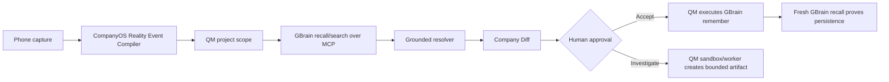

# CompanyOS Cortex — Hackathon Execution Package v2

**Tagline:** Turn human reality into company state, then let the company react.

**Hackathon thesis:** CompanyOS Cortex is a net-new, GBrain-grounded application running through the QM agent harness. A founder captures a real-world observation from a mobile surface; the observation is compiled into a typed Reality Event; QM runs the reasoning/action turn inside a scoped project workspace; GBrain supplies and persists canonical company memory; the system renders a Company Diff and requires human approval before durable mutation.

## What is new in v2
This revision makes **both QM and GBrain first-class in the P0 path**.

- **QM = runtime / harness / scoped execution environment.** It owns the project scope, agent turn, tool policy, and optional durable sandbox.
- **GBrain = canonical organizational memory.** QM reaches it through GBrain's MCP endpoint and uses real recall/search/remember operations.
- **CompanyOS Cortex = Reality Event compiler + state-transition UX.** It converts messy human observations into grounded proposed company state changes.

This avoids a shallow "we also called the sponsor API" implementation. The central demo would break if either QM or GBrain were removed.

## P0 demo loop



## MVP success definition
By submission time, the live demo must complete this exact path:

1. Capture a fresh customer update from a phone or phone-sized UI.
2. Parse it into a typed `RealityEvent`.
3. Submit the event to a **QM project-scoped turn**.
4. From that QM turn, use **real GBrain memory via MCP** to retrieve related facts.
5. Show one non-obvious grounded cross-link and deterministic derived value.
6. Render a **Company Diff** that distinguishes observed / recalled / derived / proposed state.
7. Approve one finding; QM executes the GBrain write.
8. Re-query GBrain from QM and prove the accepted learning is durable.
9. Stretch only: ask QM to create one bounded engineering artifact in its scope sandbox.

## Non-goals today
- Native iOS
- Auth/billing/RBAC
- Full CRM / PM / HR suite
- River training
- Deep Superset integration
- Memorable integration unless setup is trivial
- Multiple autonomous personas
- Reusing existing CompanyOS source code

## Recommended stack
- **QM:** organization-owned deployment or event-provided instance; one project scope called `cortex-demo`
- **GBrain:** workspace memory attached to a Full-access client at `https://gbrain.io/mcp`
- **Frontend:** Next.js + React + Tailwind, two routes (`/capture`, `/command`)
- **Compiler:** one structured LLM extraction call, strict schema
- **Realtime:** 1-second polling; no WebSocket requirement
- **Local state:** in-memory only
- **Canonical memory:** GBrain only after user approval

## Hard architectural rule
**Raw observations never become canonical memory directly.**

```text
Raw observation
  -> typed RealityEvent
  -> QM turn
  -> GBrain grounding
  -> proposed Company Diff
  -> human approval
  -> GBrain canonical write
```

## File map
- `01_PRODUCT_THESIS.md` — category and product framing
- `02_HACKATHON_RULES_AND_COMPLIANCE.md` — eligibility and net-new-build constraints
- `03_SYSTEM_ARCHITECTURE.md` — revised QM + GBrain architecture
- `04_GBRAIN_INTEGRATION.md` — canonical memory integration
- `05_EVENT_COMPILER_SPEC.md` — Reality Event compiler
- `06_AGENT_ORCHESTRATION.md` — bounded reasoning/action model
- `07_MOBILE_CAPTURE.md` — net-new mobile input surface
- `08_UX_VISUAL_SYSTEM.md` — principal-design spec
- `09_API_DATA_CONTRACTS.md` — schemas and endpoints
- `10_IMPLEMENTATION_PLAN.md` — 3-hour execution schedule
- `11_DEMO_SCRIPT.md` — 60–90 second judge demo
- `12_TEST_EXIT_CRITERIA.md` — hard go/no-go gates
- `13_FAILURE_FALLBACKS.md` — demo insurance
- `14_POST_HACKATHON_ROADMAP.md` — CompanyOS expansion
- `15_QM_INTEGRATION.md` — P0 QM integration contract
- `CODING_AGENT_MASTER_PROMPT.md` — build prompt for Codex / Claude Code
