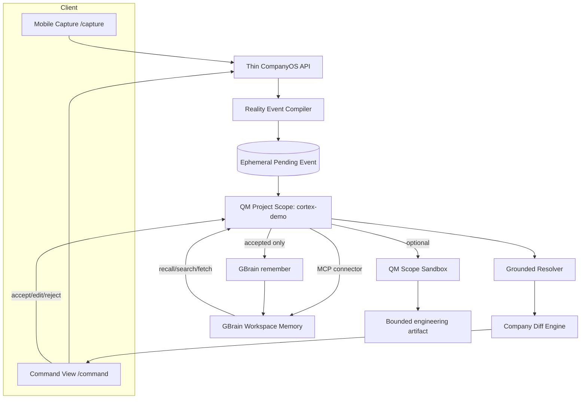

# System Architecture v2 — QM + GBrain are P0

## Architectural principles
1. **Evidence first.** Raw human input is an observation, never immediate truth.
2. **QM is the operating harness.** Every reasoning/action turn happens in a named project scope.
3. **GBrain is canonical memory.** Accepted organizational knowledge is recalled from and written to GBrain.
4. **Human approval gates durable mutations.** The system proposes; the user accepts/edits/rejects.
5. **Typed state transitions, not agent chat.** UI shows what changed and why.
6. **Provenance survives every layer.** Each recalled/derived claim points back to the source.
7. **Three-hour reliability beats breadth.** One QM turn and one GBrain round trip are more important than many sponsor integrations.

## High-level architecture



## Why QM belongs in the critical path
QM is not a sidecar. It provides the durable **project scope** that binds:
- the agent identity
- the GBrain MCP connector
- tool permissions
- the reasoning/action turn
- optional sandbox/files
- auditability of the work

For the demo, use one project scope: `cortex-demo`.

The product UI can remain custom, but a submitted Reality Event becomes work by invoking a QM turn in that scope. The QM agent receives the event and calls GBrain tools. This makes the stack relationship obvious:

```text
CompanyOS = sensing + state-transition UX
QM        = scoped execution / agent harness
GBrain    = durable company memory
```

## Runtime sequence
1. User submits observation from mobile surface.
2. CompanyOS compiler emits `RealityEvent` JSON.
3. Backend invokes or posts the event into the QM `cortex-demo` project scope.
4. QM agent executes a bounded system instruction: ground this event against GBrain, return strict `GroundedResolution` JSON.
5. QM calls GBrain `search/recall/fetch` via MCP.
6. CompanyOS combines returned evidence with deterministic local calculations.
7. UI renders Company Diff.
8. User approves or edits.
9. Approval is sent as a second QM turn that calls GBrain `remember`.
10. A fresh QM/GBrain recall proves persistence.

## Minimal component boundaries

### CompanyOS API
Responsibilities only:
- receive observation
- run compiler
- invoke QM turn
- store pending event in memory
- perform deterministic arithmetic / diff formatting
- pollable status endpoint

It must not become another agent framework.

### QM project scope
Responsibilities:
- run grounded reasoning
- expose GBrain MCP tools to the agent
- enforce bounded prompts / permissions
- optionally create `docs/saml-feasibility.md` in the scope sandbox

### GBrain workspace
Responsibilities:
- hold seeded synthetic company state
- answer recall/search/fetch with provenance
- persist accepted event notes

## State model
Never collapse these four categories:

```ts
type KnowledgeKind =
  | "observed"   // came from today's human input
  | "recalled"   // came from GBrain
  | "derived"    // deterministic combination/arithmetic
  | "proposed";  // system recommendation, not truth
```

This is both an architectural safety mechanism and the visual language of the demo.

## Three-hour exclusions
- no custom distributed queue
- no Postgres requirement for CompanyOS
- no native iOS
- no WebSockets
- no multi-agent fan-out unless P0 is green
- no Superset/Memorable/River in the critical path
